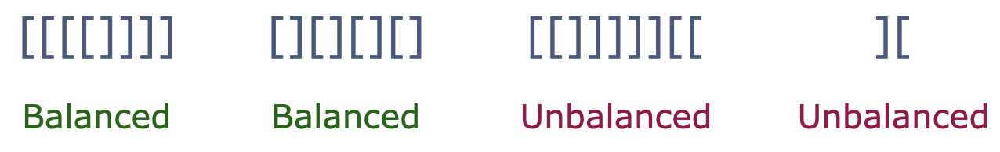
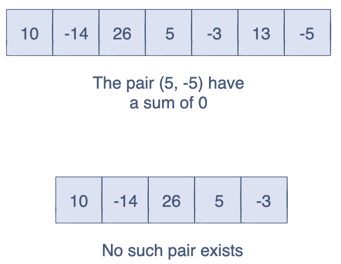

# PythonLearning
## Exercise 1: Gravitational Force
Gravitational force is the attractive force that exists between two masses. It can be calculated by using the following formula:

    Fg = G*M*m/(r ** 2)
G is the gravitational constant, M and m are the two masses, and r is the distance between them.

You must implement this equation in Python to calculate the gravitational force between Earth and the moon.

## Exercise 2: Discounted Price
In this challenge, you must discount a price according to its value.

 - If the price is 300 or above, there will be a 30% discount.

 - If the price is between 200 and 300 (200 inclusive), there will be a 20% discount.

 - If the price is between 100 and 200 (100 inclusive), there will be a 10% discount.

 - If the price is less than 100, there will be a 5% discount.

 - If the price is negative, there will be no discount.

## Exercise 3: The Factorial! 
In this challenge, you must implement the `factorial()` function. It takes an integer as a parameter and calculates its factorial. Python does have a built-in factorial function but you’ll be creating your own for practice.

## Exercise 4: Balanced Brackets
Given a string containing only square brackets, [], you must check whether the brackets are balanced or not. The brackets are said to be balanced if, for every opening bracket, there is a closing bracket.

You will write your code in the `check_balance()` function, which returns True if the brackets are balanced and False if they are not.

For an empty string, the function will return True.

For the sake of simplicity, you can assume that the string will not contain any other characters.

## Exercise 5: A Sum of Zero
You must implement the `check_sum()` function which takes in a list and returns True if the sum of two numbers in the list is zero. If no such pair exists, return False.

## Exercise 6: Fibonacci Series
The Fibonacci sequence is a series of numbers where every number is the sum of the two numbers before it. The first two numbers are 0 and 1:

    0 1 1 2 3 5 8 13
You must write the `fib()` function which takes in a positive integer, n, and returns the n-th Fibonacci number. However, instead of using recursion, your function must use any of the loops.